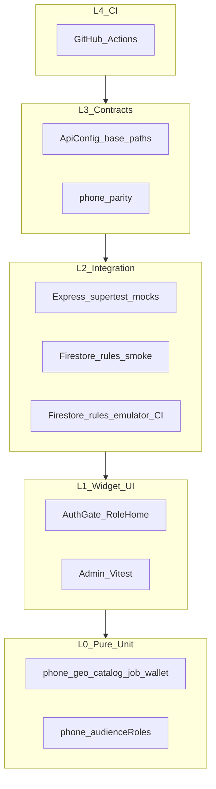
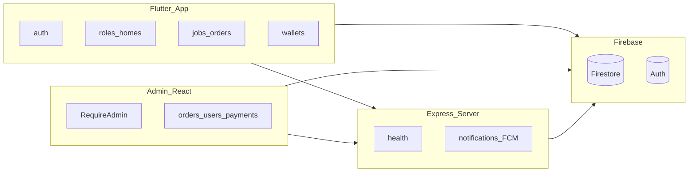

# مخطط الاختبارات الكامل — منظومة barrr

## النطاق

ثلاث طبقات قابلة للاختبار (بدون Cloud Functions وبدون مسار رمز التحقق OTP):

- تطبيق Flutter: [`barrr/`](./)
- لوحة الإدارة React: [`../barrr-admin/`](../barrr-admin/)
- خادم Express (FCM / إشعارات): [`../barrr-admin/server/`](../barrr-admin/server/)

> **مستبعد من هذا المخطط:** Cloud Functions، ومسارات OTP / رمز التحقق / WhatsApp للتحقق، وPlaywright E2E كامل.

---

## 1) هرم الاختبارات



| الطبقة | الحالة |
|--------|--------|
| L0–L1 | مغطاة محلياً (Flutter + Vitest + node:test) |
| L2 | Express mocks + rules smoke؛ emulator في CI (يتطلب Java) |
| L3–L4 | عقود هاتف/API + [`.github/workflows/test.yml`](../.github/workflows/test.yml) |

---

## 2) خريطة الطبقات والمكوّنات



---

## 3) التدفقات الحرجة

### أ) المصادقة (بدون OTP)

- `AuthGate` → ملف بلا هاتف → `AddPhoneScreen` → ملف مكتمل → `RoleHome`
- اختبارات: [`test/auth_gate_test.dart`](./test/auth_gate_test.dart)، [`test/role_home_test.dart`](./test/role_home_test.dart)

### ب) دورة الطلب

- حالات/أنواع/فاتورة: [`test/job_logic_test.dart`](./test/job_logic_test.dart)
- مطابقة جغرافية: [`test/geo_test.dart`](./test/geo_test.dart)

### ج) المحفظة

- [`test/wallet_logic_test.dart`](./test/wallet_logic_test.dart)
- Admin: [`../barrr-admin/src/lib/adminWallet.test.ts`](../barrr-admin/src/lib/adminWallet.test.ts)

### د) الإشعارات / Express

- [`../barrr-admin/server/api.test.js`](../barrr-admin/server/api.test.js) — health، send، test مع mocks عبر `createApp`
- منطق رسائل الطلبات: [`../barrr-admin/server/job_notify.js`](../barrr-admin/server/job_notify.js) + [`job_notify.test.js`](../barrr-admin/server/job_notify.test.js)
- الإرسال الفعلي عبر [`watchers.js`](../barrr-admin/server/watchers.js) (يتطلب تشغيل السيرفر + `fcmToken`)

**مصفوفة إشعارات الطلبات**

| الحدث | المشغّل | المستلم |
|-------|---------|---------|
| طلب جديد للمزوّد | إضافة `jobOffers` بحالة `pending` | المزوّد المعروض عليه |
| عرض سعري / مقارنة | `quoted` / `comparing` | العميل |
| قبول طارئ (`offerPending`→`enRoute`) | تغيّر الحالة | العميل: «تم قبول طلبك» + الفني: «تم تعيينك» |
| اختيار عميل (`comparing`/`quoted`→`enRoute`) | تغيّر الحالة | العميل تأكيد + الفني «العميل وافق» |
| وصل / سعر نهائي / بدء / إكمال / إلغاء / لا فني | تغيّر الحالة | حسب `messagesForTransition` |

### هـ) قواعد Firestore

- دخان: [`rules-test/rules.smoke.test.js`](./rules-test/rules.smoke.test.js)
- Emulator: [`rules-test/rules.test.js`](./rules-test/rules.test.js) (CI + محلياً إن وُجد Java)

---

## 4) الموجود اليوم

| الملف / المسار | النوع |
|----------------|-------|
| `test/widget_test.dart` | كتالوج / نماذج |
| `test/api_config_test.dart` | ApiConfig |
| `test/orders_screen_test.dart` | فلاتر طلبات |
| `test/geo_test.dart` | geo |
| `test/phone_test.dart` | هاتف |
| `test/job_logic_test.dart` | منطق الطلب |
| `test/wallet_logic_test.dart` | محفظة |
| `test/auth_gate_test.dart` | AuthGate widget |
| `test/role_home_test.dart` | RoleHome widget |
| `test/support/test_app_scope.dart` | مساعد اختبار |
| `../barrr-admin/server/phone_fcm.test.js` | هاتف + audience |
| `../barrr-admin/server/api.test.js` | Express HTTP mocks |
| `../barrr-admin/server/job_notify.test.js` | رسائل انتقال حالة الطلب |
| `../barrr-admin/src/lib/*.test.ts` | Vitest Admin |
| `rules-test/` | قواعد Firestore |
| `../.github/workflows/test.yml` | CI |

### فجوات اختيارية لاحقة

1. Playwright E2E للوحة الإدارة (يتطلب سيرفرات حية)
2. تكامل JobRepository ضد Firestore Emulator
3. تشغيل `rules-test` emulator محلياً (يتطلب Java)

---

## 5) أوامر التشغيل

```bash
# Flutter
cd barrr && flutter test
# أو: C:\Users\GWY-6\flutter\bin\flutter.bat test

# Express
cd barrr-admin/server && npm test

# Admin Vitest
cd barrr-admin && npm test

# قواعد (دخان — بدون Java)
cd barrr/rules-test && npm test

# قواعد (Emulator — يتطلب Java + firebase-tools)
cd barrr && npx firebase-tools emulators:exec --only firestore --project demo-barrr "node --test rules-test/rules.test.js"
```

---

## 6) ملخص المستبعد

| المستبعد | السبب |
|----------|--------|
| Cloud Functions | أُزيلت من التطبيق و`firebase.json`؛ المنطق على التطبيق + Express |
| OTP / WhatsApp verify | خارج نطاق اختبارات الوحدة الحالية |
| Playwright E2E | اختياري لاحق — هش ويحتاج بيئة تشغيل كاملة |
